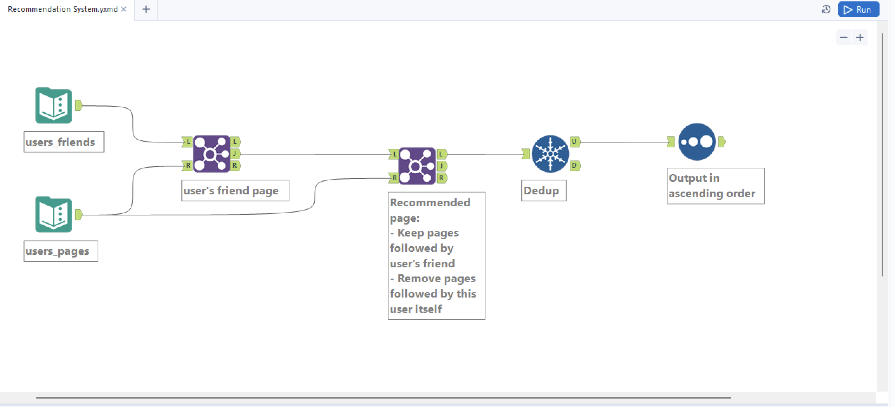

# Recommendation System

Medium 

You are given the list of Facebook friends and the list of Facebook pages that users follow.

Your task is to create a new recommendation system for Facebook. For each Facebook user,

find pages that this user doesn't follow but at least one of their friends does.

Output the user ID and the ID of the page that should be recommended to this user.

### Tables

### users_friends

| user_id | friend_id |
|----------|------------|
| 1        | 2          |
| 1        | 4          |
| 1        | 5          |
| 2        | 1          |
| 2        | 3          |
| 2        | 4          |
| 2        | 5          |
| 3        | 2          |
| 4        | 1          |
| 4        | 2          |
| 5        | 1          |
| 5        | 2          |

### users_pages

| user_id | page_id |
|----------|----------|
| 1        | 21       |
| 1        | 25       |
| 2        | 25       |
| 2        | 23       |
| 2        | 24       |
| 2        | 28       |
| 2        | 21       |
| 3        | 25       |
| 3        | 24       |
| 5        | 23       |
| 5        | 28       |

```sql
WITH users_friend_follow AS (
    SELECT DISTINCT users_friends.user_id, users_pages.page_id 
    FROM users_friends 
    INNER JOIN users_pages 
    ON users_friends.friend_id = users_pages.user_id  
), 
recommended_page AS (
    SELECT DISTINCT users_friend_follow.*   
    FROM users_friend_follow 
    LEFT JOIN users_pages 
    ON users_friend_follow.user_id = users_pages.user_id 
    AND users_friend_follow.page_id = users_pages.page_id 
    WHERE users_pages.page_id IS NULL 
) 
SELECT * 
FROM recommended_page 
ORDER BY user_id ASC, page_id ASC
```  
## Alteryx Workflow 

